# console_app.csharp

1. Simple Creature
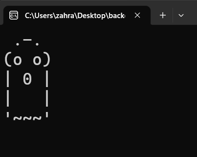

2. Holmes Creature
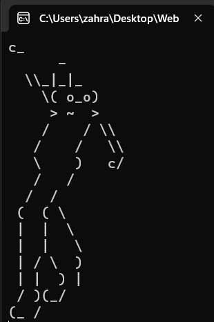

3. Average Score 
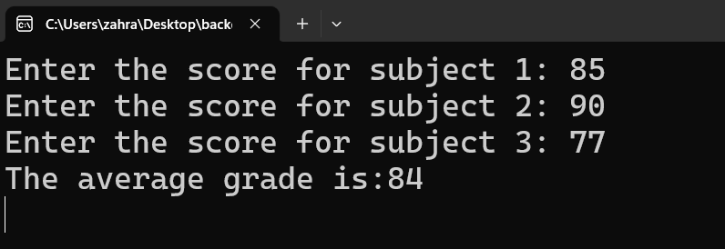

4. Temperature (celsius to fahrenheit)
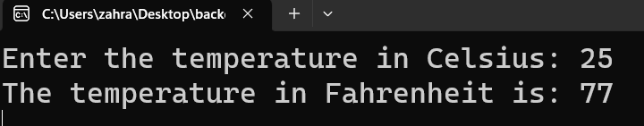

5. Conversion
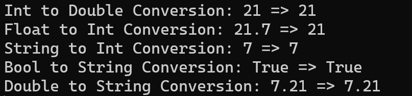

6. Task Increment
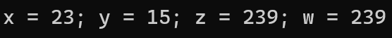

7. Arithmetic Task
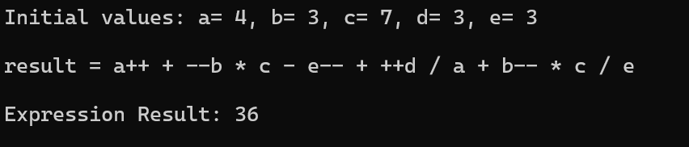

8. Arithmetic Operators
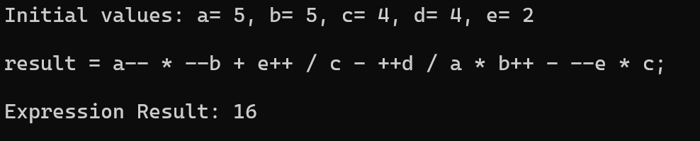

9. Condition if-else
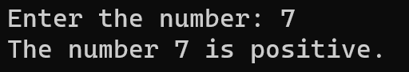

10. Condition switch case
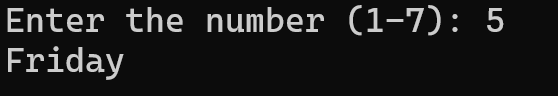

11. Precedence Operators 
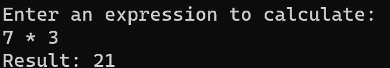

12. Date to Weekdays task
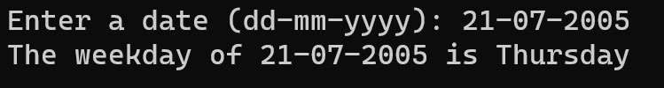

13. Multiple of even numbers (Recursive)
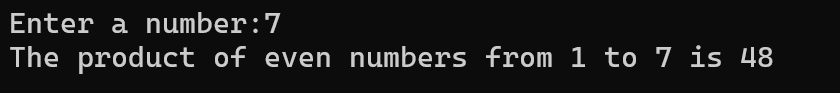

14. Ternary Operators
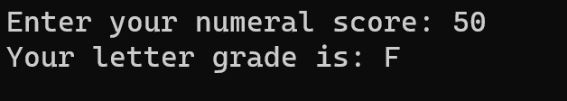

15. Factorial Loop
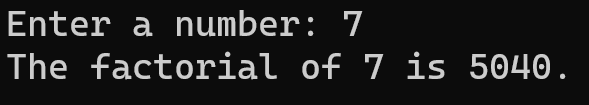

16. Recursive Reverse Function
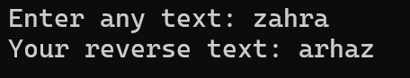

17. Sum of odd numbers
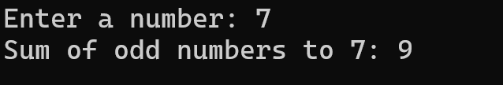

18. Swapping Task
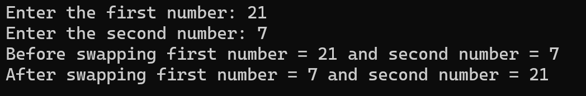

19. StudentSystem (encapsulation) 

1.  sum of even numbers in array
     